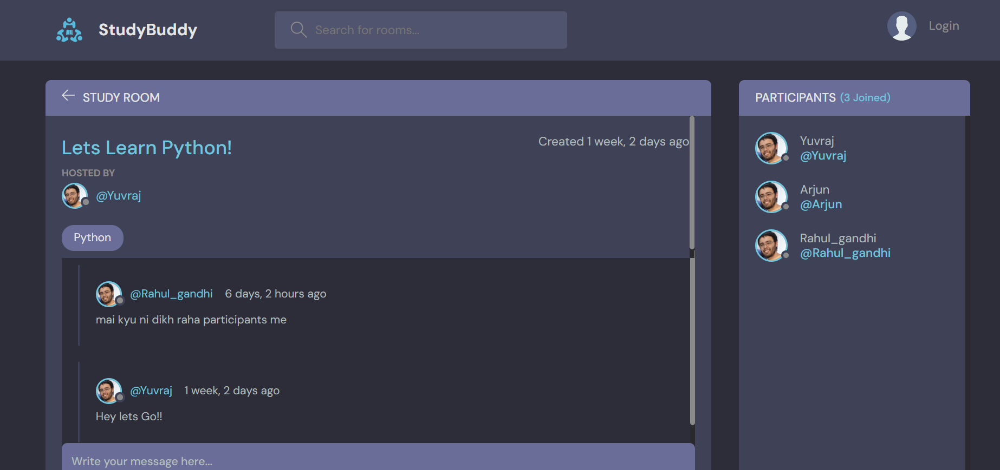
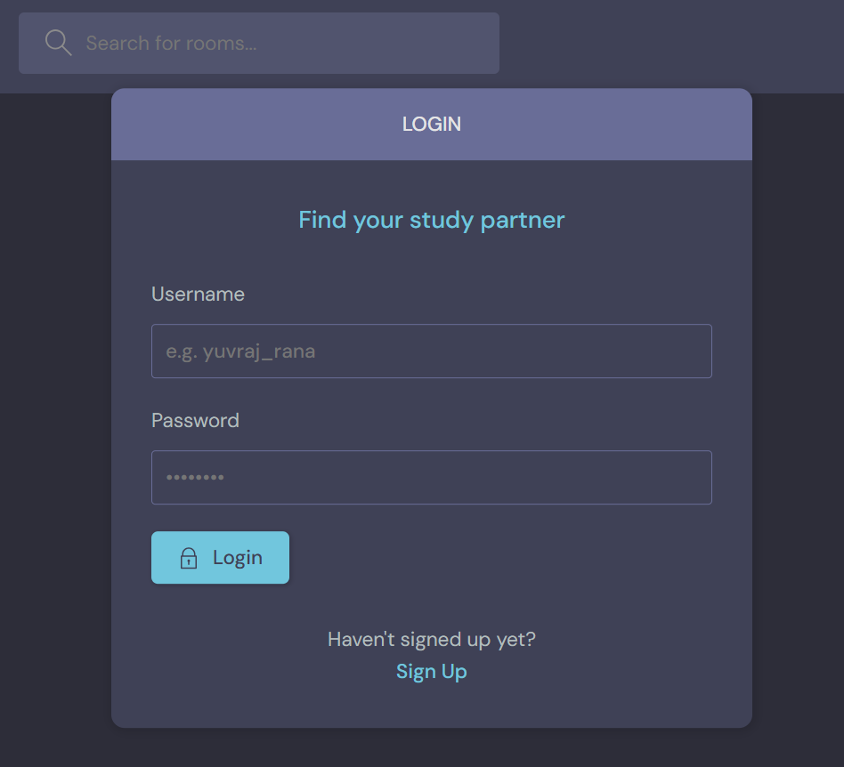

# StudyCord 

StudyCord is a Django-based community discussion platform where users can create rooms, join conversations, and share knowledge.  
It was built as my first Django project (following a tutorial) to learn the fundamentals of web development, REST APIs, authentication, and template rendering.

## 🚀 Features
- User authentication (register, login, logout, profile management)  
- Create, update, and delete **discussion rooms**  
- Topic-based organization of conversations  
- Real-time activity feed (recent messages and room activity)  
- REST API endpoints (Django REST Framework)  
- Responsive UI with custom templates and static assets  
- Clean project structure with separation of concerns  

## 📁 Project Structure
StudyCord/

├── manage.py # Django project manager

├── db.sqlite3 # Default SQLite database

├── StudyCord/ # Project configuration (settings, urls, wsgi)

├── base/ # Main app (models, views, urls, forms, api)

│ ├── api/ # API (serializers, views, urls)

│ ├── migrations/ # Database migrations

│ ├── templates/base/ # App-specific templates

│ ├── static/ # Static files (css, js, images)

│ └── ...

├── templates/ # Global templates (navbar, base layout)

└── static/ # Project-wide static files

## ⚙️ Installation & Setup

### Prerequisites
- Python 3.10+
- pip (Python package manager)
- Virtual environment (recommended)

### Steps

1. **Clone the repository**
   ```bash
   git clone https://github.com/Yuvraj-Rana-25/StudyCord.git
   cd StudyCord
   ```
2. **Create and activate virtual environment**
   ```bash
   python -m venv venv
   source venv/bin/activate    # On Linux/Mac
   venv\Scripts\activate       # On Windows
   ```
3. **Run migrations**
   ```bash
   python manage.py migrate
   ```
4. **Create a superuser**
   ```bash
   python manage.py createsuperuser
   ```

5. **Start the development server**
   ```bash
   python manage.py runserver
   ```

6. **Open in browser:** http://127.0.0.1:8000/

## 📸 Screenshots
#### Home Page

#### Room Page

#### Login Page



